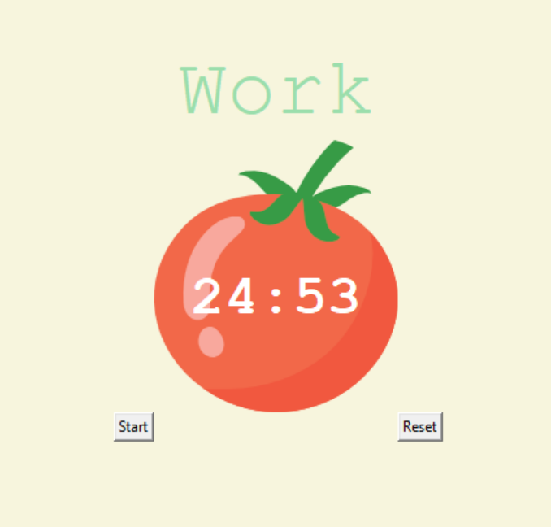

# Pomodoro Application
## Description
This is a simple pomodoro application that allows you to set a timer for 25 minutes and then take a 5 minute break. This is a great way to stay focused and get work done.

## How to use
1. Clone the repository
2. Run main.py
3. Click the start button to start the timer

## Screenshots

Created as a part of Udemys 100 days of code course by Angela Yu.